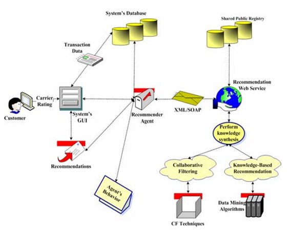

####Intermodal transportation system - Recommeders

In Intermodel Transportation Systems ( multiple modes of transportation like rail, ship, truck etc. without any handling of the freight itself when changing modes ) , the recommenders play key role in optimizing the transportation plans/routes/carriers.

This paper describes one of such systems: https://arxiv.org/ftp/arxiv/papers/0909/0909.2376.pdf

A transportation plan typically defines the user preferences for the upcoming transactions. The below are some sample plans:

  * Express  	-   Speed. I want the delivery ASAP, does not matter even if it costs little more
  * Economic	-   Cheaper the better. Its okay to be delayed a bit, but I want cheaper option.
  * Safe  		-   High level of safety in carrying my load. etc.

Accordingly, the recommender system should choose the alternative route paths/carriers.

The high level phases in this complex process includes:

  1. the evaluation of the carriers and the transactions data; 
  2. the exploitation of transaction data through a data mining process, and 
  3. the recommendation methodology selection or synthesis.

The evaluation of a transaction is based on various criteria like, *cost, duration, safety, reliability, carrier scores, average scores of the sub-routes contained in the transaction, popularity of the specific route, number of transloadings* etc.

The below is high level architecture of a productional system that leverages recommender services.

